# Sorting Algorithms Experiment Report

## Algorithm Performance Comparison

### Slowest and Fastest Algorithms

The slowest and fastest algorithms depended on different array sizes and types. The array types were random (unsorted), first 50% sorted, first 75% sorted, fully ordered, and reverse ordered. The sizes ranged from 22 through 215.The algorithms compared were:
- Insertion sort
- Selection sort
- Bubble sort
- Shell sort
- Merge sort
- Quick sort with the first element as the pivot
- Quick sort with a random element as the pivot
- Quick sort with the pivot selected using the median of three approach
- Heap sort
- Counting sort
- Bucket sort
- Radix sort

Shell, bubble, and insertion sorts were consistently the fastest algorithms, while counting, bubble, heap, merge, and selection sorts were the slowest. Shell and bubble sort were generally faster for smaller array sizes, insertion and shell sort for medium, and insertion sort for large. Counting did the worst with smaller array sizes, while bubble and heap both did poorly on medium to large array sizes.

Fastest by Array Type and Size:

| Array Size | Fastest (Random) | Fastest (50% Sorted)	 | Fastest (75% Sorted) | Fastest (Ordered) | Fastest (Reverse Ordered) |
|------------|------------------|-----------------------|----------------------|-------------------|---------------------------|
| 4          | Bubble           | Bubble                | Shell                | Insertion         | Shell                     |
| 8          | Bubble           | Insertion             | Shell                | Bubble            | Shell                     |
| 16         | Shell            | Insertion             | Insertion            | Shell             | Shell                     |
| 32         | Shell            | Insertion             | Insertion            | Bubble            | Shell                     |
| 64         | Shell            | Insertion             | Insertion            | Bubble            | Shell                     |
| 128        | Shell            | Insertion	            | Insertion	           | Bubble            | Shell                     |
| 256        | Shell            | Insertion	            | Insertion	           | Bubble            | Shell                     |
| 512        | Shell            | Insertion	            | Insertion	           | Bubble            | Shell                     |
| 1024	      | Shell	           | Insertion	            | Insertion	           | Bubble            | Shell                     |
| 2048	      | Shell	           | Insertion	            | Insertion	           | Bubble            | Shell                     |
| 4096	      | Shell	           | Insertion	            | Insertion	           | Bubble            | Insertion                 |
| 8192	      | Insertion	       | Insertion	            | Insertion	           | Bubble            | Insertion                 |
| 16384      | Insertion        | Insertion             | Insertion            | Bubble            | Insertion                 |
| 32768      | Insertion        | Insertion             | Insertion            | Bubble            | Insertion                 |  

Slowest by Array Type:

| Array Size  | Slowest (Random) | Slowest (50% Sorted)  | Slowest (75% Sorted)  | Slowest (Ordered)  | Slowest (Reverse Ordered) |
|-------------|------------------|-----------------------|-----------------------|--------------------|---------------------------|
| 4	          | Counting	        | Counting	             | Counting	             | Counting	          | Counting                  |
| 8	          | Counting	        | Counting	             | Counting	             | Counting	          | Counting                  |
| 16	         | Counting	        | Counting	             | Counting	             | Counting	          | Counting                  |
| 32	         | Counting	        | Counting	             | Counting	             | Counting	          | Counting                  |
| 64	         | Counting	        | Heap	                 | Counting	             | Merge	             | Counting                  |
| 128	        | Selection	       | Heap	                 | Counting	             | Merge	             | Bubble                    |
| 256	        | Merge	           | Bubble	               | Heap	                 | Merge	             | Heap                      |
| 512	        | Heap	            | Bubble	               | Heap	                 | Merge	             | Bubble                    |
| 1024	       | Heap	            | Bubble	               | Heap	                 | Heap	              | Bubble                    |
| 2048	       | Heap	            | Selection	            | Heap	                 | Heap	              | Heap                      |
| 4096	       | Bubble	          | Heap	                 | Heap	                 | Heap	              | Bubble                    |
| 8192	       | Bubble	          | Bubble	               | Heap	                 | Heap	              | Heap                      |
| 16384	      | Bubble	          | Bubble	               | Bubble	               | Heap	              | Heap                      |
| 32768	      | Bubble	          | Bubble	               | Bubble	               | Heap	              | Heap                      |

Comparing all array types, the fastest and slowest algorithm / type combinations were:

| Array Size | Fastest Algorithm with Array Type | Slowest Algorithm with Array Type |
|------------|-----------------------------------|-----------------------------------|
| 4          | Shell - 75% Sorted           | Counting - 50% Sorted        |
| 8          | Bubble - Ordered             | Counting - 50% Sorted        |
| 16         | Shell - Reverse Ordered      | Counting - 50% Sorted        | 
| 32         | Shell - Reverse Ordered      | Counting - 50% Sorted        |
| 64         | Insertion - 75% Sorted       | Heap - 50% Sorted            |
| 128        | Bubble - Ordered             | Heap - 50% Sorted            |
| 256        | Insertion - 75% Sorted       | Bubble - 50% Sorted          |
| 512        | Bubble - Ordered             | Bubble - 50% Sorted          |
| 1024       | Insertion - 75% Sorted       | Bubble - 50% Sorted          |
| 2048       | Insertion - 75% Sorted       | Selection - 50% Sorted       |
| 4096       | Insertion - 75% Sorted       | Heap - 50% Sorted            |
| 8192       | Insertion - 75% Sorted       | Bubble - Random              |
| 16384      | Insertion - 75% Sorted       | Bubble - Random              |
| 32768      | Insertion - 75% Sorted       | Bubble - Random              |

Because bubble sort is O(N) in its best case scenario (which occurs when the array is already ordered), and O(N2) for its average and worst case scenarios, I wasn't surprised for it to show up in both the fastest and slowest lists, although I would have expected it to be slowest for reverse sorted arrays. Likewise, even though insertion sort is average and worst O(N2), it's best case scenario is O(N). I was also a little surprised that this occurred with 75% sorted arrays, as I would have expected the best case scenario to be with fully ordered arrays. Shell sort's best case is O(N log N), but should occur if the array is already sorted, so I was somewhat confused to see it occur for reverse ordered arrays.

Notably, one single algorithm did not completely dominate the fastest or slowest lists. This demonstrates the importance of choosing a sorting algorithm that works best for your data size and structure.

### Algorithm Tradeoffs and Application Suitability

## Quick Sort

## Implementation

For my implementation, I followed the classic recursive quick sort algorithm, using the divide-and-conquer strategy. I selected the pivot, partitioned the array using the selected pivot, and then recursively called quicksort on the left and right subpartitions. To partition the array, I used left and right markers. This was based on what we learned in class and in the textbook. By doing so, I believe I stayed true to the nature of quick sort.

Additionally, for my quick sort class, I chose to use an abstract class. I implemented all other methods, but left the pivot selection method as abstract. By doing so, I was able to create smaller classes for the three different quick sort implementations based on pivot selection:
- Quick sort using the first element as the pivot.
- Quick sort using the median-of-threes technique for selecting the pivot.
- Quick sort using a random element as the pivot

These classes extended the abstract quick sort class and implemented the pivot selection method accordingly.

Lastly, some of my teammates encountered a StackOverflow error when running quick sort with the first element as the pivot. This occurred on large mostly sorted arrays (75% sorted and fully sorted). While I was not able to reproduce the issue, due to computer differences, we changed our experiment design to accommodate the issue. Instead of crashing the entire experiment with the StackOverflow exception, we caught the error and made the time duration output -1000. This signifies in the data that the experiment crashed for the specific array, since it's impossible to have a negative duration.

To resolve the StackOverflow issue, I considered using a stack to iteratively implement quick sort. I also considered switching to insertion sort for smaller subpartitions. However, for the purposes of the experiment, I wanted to keep quick sort recursive. If anything, the StackOverflow exceptions encountered showed the issues with using QuickSort with a poor pivot selection. Thus, instead of being problematic, it served a valuable purpose in illustrating how QuickSort can reach O(N2), due to selecting the smallest or largest pivot element, and the problems that can cause.

### Quick Sort with First Element Pivot Results

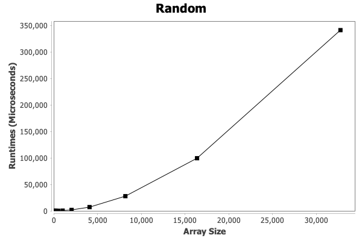
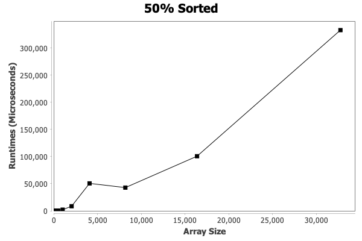
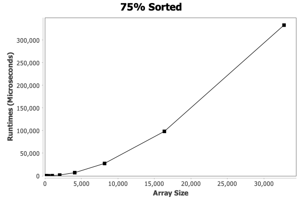
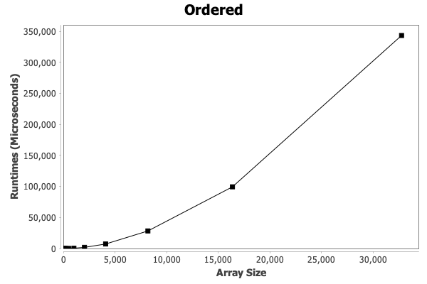

### Quick Sort with Median of Threes Pivot Results

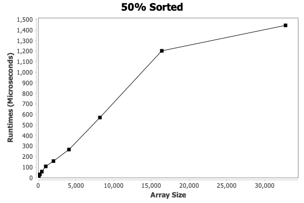

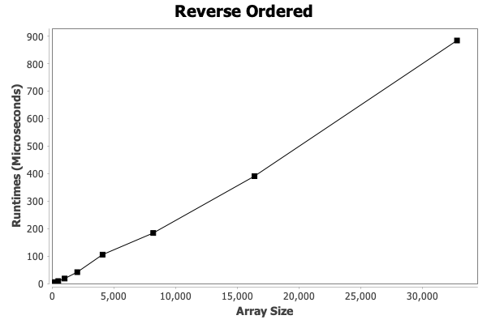

### Quick Sort with Random Element Pivot Results

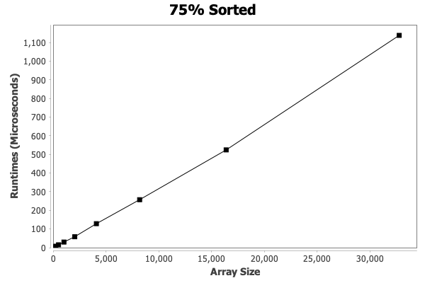

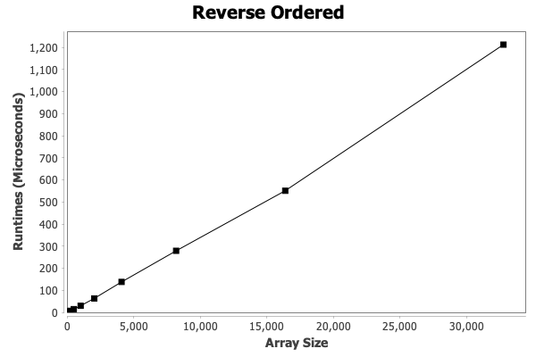

## Findings

As expected, quick sort using the first element as the pivot performed the worst of all three pivot selection methods. This showed how quick sort can approach O(N2), as the first element was the smallest or largest element in the array if the array was 50% sorted, 75% sorted, fully sorted, or reverse sorted.

You can see this clearly here when comparing the average runtimes per array for the different pivot selection methods, how quick sort with the first element pivot selection is similar to O(N2), while quick sort with the other two pivot selection methods are similar to O(N log N):

I was surprised that there were not bigger differences between random, 75%, sorted, and reverse sorted arrays. For example, see these aggregated data charts of the results per pivot selection method:

   
   

I also found it interesting that the 50% sorted arrays seemed to result in uniquely variable and poor performance. This persisted across all three pivot selection methods. After researching the phenomena, I determined it is expected behavior.

For the median of threes pivot method, if the first half is sorted and the second random,
it can lead to an unideal pivot selection.

Similarly, with the random element selection, if the element is randomly selected from the 50% sorted half, it could lead to unbalanced partitions. However, if it's selected from the unsorted half, the performance could vary based on which value is chosen. Alternatively, in a 75% sorted array, the random pivot selection is more likely to choose a pivot from the sorted portion, leading to more balanced partitions. With the first element selection, the 50% sorted array means that the first pivot is going to be the worst choice. However, unlike the 75% sorted array, the unsorted half will result in worse performance due to more recursive calls.

I was also surprised that the benefit of the median of threes approach was not huge compared to the random pivot selection. While there was a modest runtime improvement with the median of threes pivot selection approach on average, I was expected the difference to be greater.

Overall, the quick sort results matched theoretical expectations. 

## Selection Sort

## Implementation

There is little creativity to be done with implementing selection sort without turning it into a different algorithm, which is tempting given its inefficiency. The resulting algorithm is a simple nested for loop that continuously compares every single element with the index being sorted.

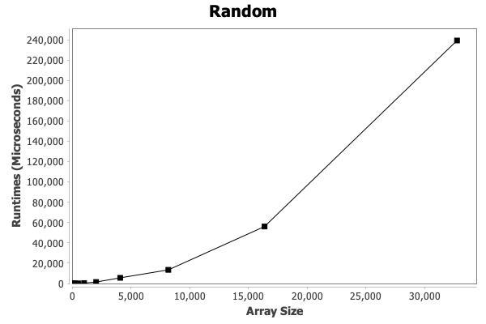
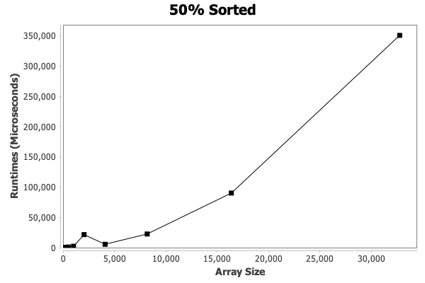
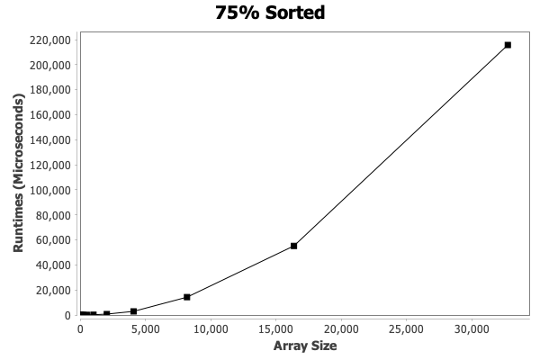

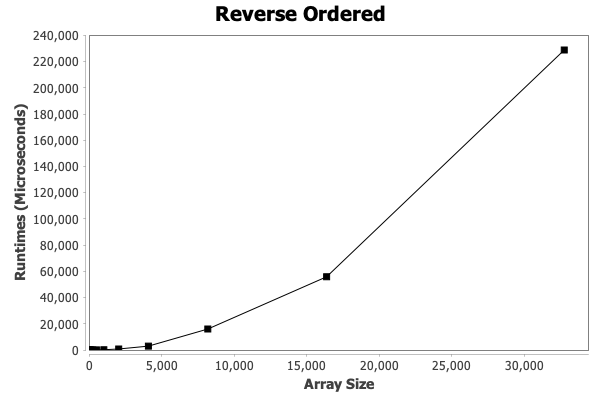

## Findings

The resulting charts align closely with the expected Big-O complexity of O(n^2) with little variance between the different types of array, which makes sense because the unsophisticated algorithm checks every remaining element for every index regardless of the order.

## Bucket Sort

## Implementation

I had a hard time finding a definitive implementation of bucket sort in my searching. There are many applications that include passing the algorithm an array as well as an n = number of buckets. This approach would not work for this test, because the sorters only receive arrays. Other implementations included a fixed bucket size which I also did not consider because of the fairly extreme range in sizes of array it was going to be sorting.

After more research and some considerations I decided to have the number of buckets be n = the square root of the length of the array. This provided a bucket count that would appropriately dynamically change with the size of the given array.

Once the number of buckets problem had been solved I finished writing the algorithm in the expected bucket sort way. The numbers are sorted into their buckets using a simple indexing function before the buckets are sorted with Collections.sort and finally being reintegrated into the original array.

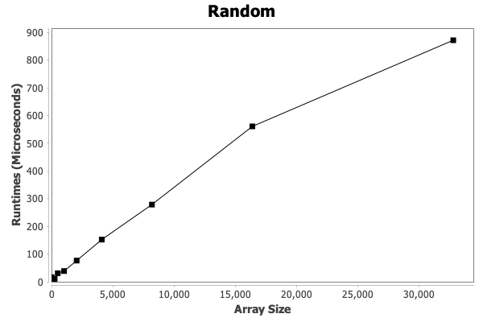
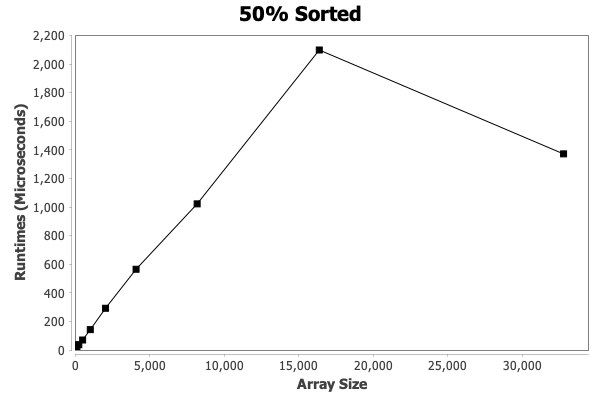
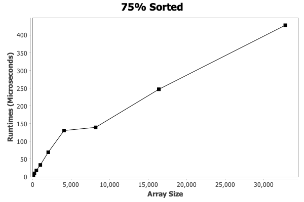
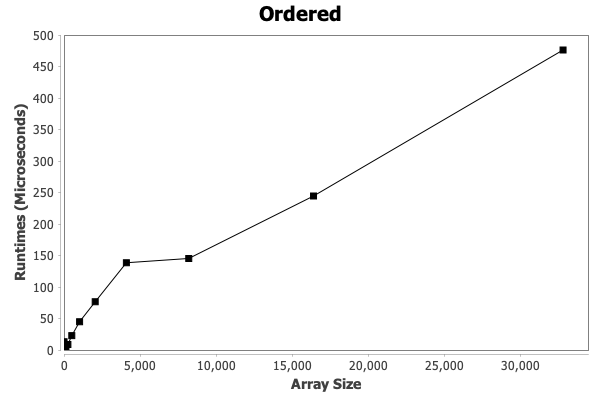
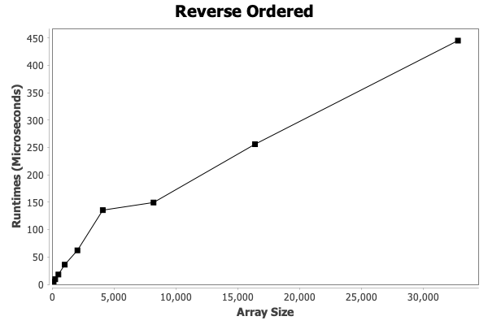

## Findings

The resulting charts, with the exception of outliers, accurately reflect the Big-Theta and Big-Omega complexities of linear time with little variance between types of array. The worst case of O(n^2) is not seen in these charts, suggesting that the worst case isn't represented in this test, or perhaps more likely whoever wrote the algorithm did an incredible job.  

## Merge Sort

## Implementation

Merge sort's implementation is done with typical recursive calls of splitting and merging, with the sorting happening in the merge stage. I had very little consideration for alternative implementations to this algorithm because of the time spent with it in class.

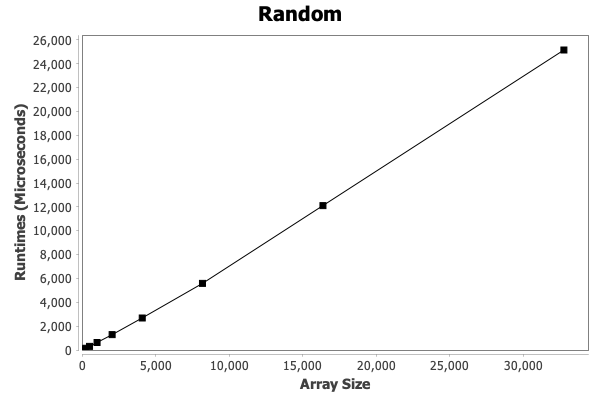
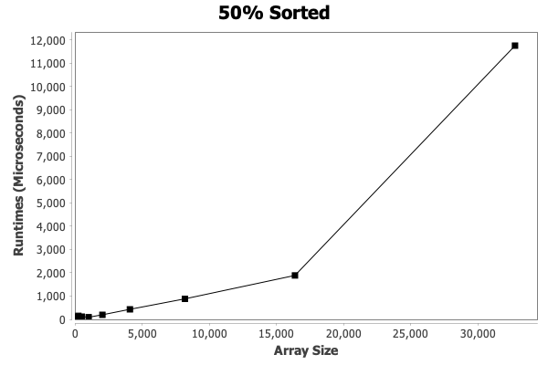
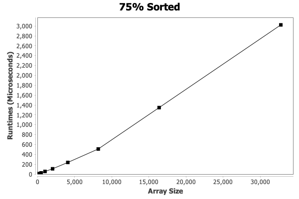
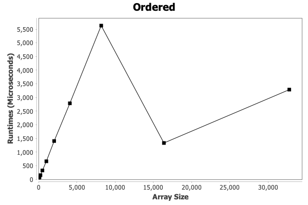
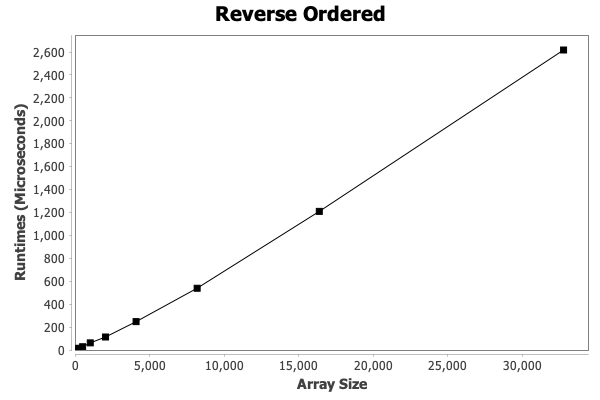

## Findings

The results of the test are surprising. If you exclude outliers and look at the curve of each test, they all follow the expected Big-O complexity of O(n log n), but the runtime on different arrays is vastly different. It's possible that the implementation of the algorithm is flawed, but I'm fairly certain that's not the case. I think that even though the total times are different per array, they all fall within the range of logarithmic time, especially given the appearance of each curve excluding outliers.
