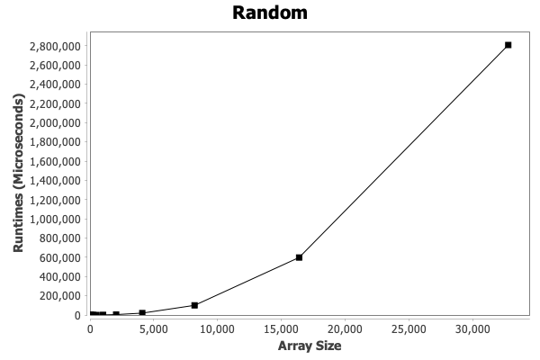
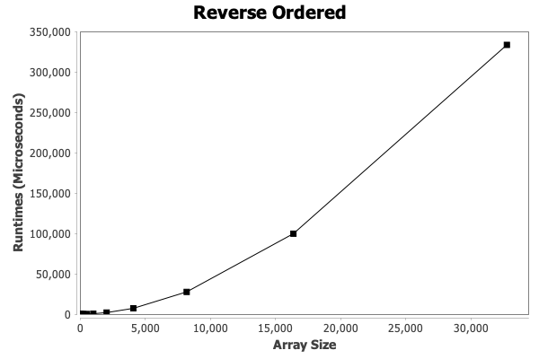
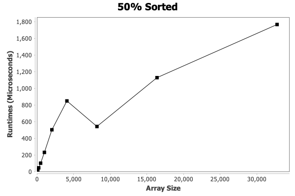
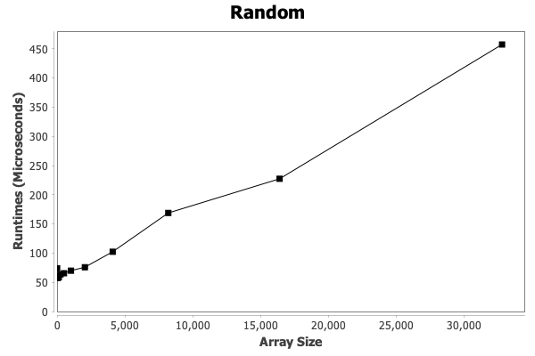

# Sorting Algorithms Experiment Report

## Algorithm Performance Comparison

### Slowest and Fastest Algorithms

The slowest and fastest algorithms depended on different array sizes and types. The array types were random (unsorted), first 50% sorted, first 75% sorted, fully ordered, and reverse ordered. The sizes ranged from 22 through 215. The algorithms compared were:
- Insertion sort
- Selection sort
- Bubble sort
- Shell sort
- Merge sort
- Quick sort with the first element as the pivot
- Quick sort with a random element as the pivot
- Quick sort with the pivot selected using the median of three approach
- Heap sort
- Counting sort
- Bucket sort
- Radix sort

Shell, bubble, and insertion sorts were consistently the fastest algorithms. Shell and bubble sort were generally faster for smaller array sizes, insertion and shell sort for medium, and insertion sort for large.

Fastest by Array Type and Size:

| Array Size | Fastest (Random)  | Fastest (50% Sorted) | Fastest (75% Sorted) | Fastest (Ordered) | Fastest (Reverse Ordered) |
|------------|-------------------|----------------------|----------------------|-------------------|---------------------------|
| 4          | Bubble            | Bubble               | Shell                | Insertion         | Shell                     |
| 8          | Bubble            | Insertion            | Shell                | Bubble            | Shell                     |
| 16         | Shell             | Insertion            | Insertion            | Shell             | Shell                     |
| 32         | Shell             | Insertion            | Insertion            | Bubble            | Shell                     |
| 64         | Shell             | Insertion            | Insertion            | Bubble            | Shell                     |
| 128        | Shell             | Insertion            | Insertion            | Bubble            | Shell                     |
| 256        | Shell             | Insertion            | Insertion            | Bubble            | Shell                     |
| 512        | Shell             | Insertion            | Insertion            | Bubble            | Shell                     |
| 1024       | Shell             | Insertion            | Insertion            | Bubble            | Shell                     |
| 2048       | Shell             | Insertion            | Insertion            | Bubble            | Shell                     |
| 4096       | Shell             | Insertion            | Insertion            | Bubble            | Insertion                 |
| 8192       | Insertion         | Insertion            | Insertion            | Bubble            | Insertion                 |
| 16384      | Insertion         | Insertion            | Insertion            | Bubble            | Insertion                 |
| 32768      | Insertion         | Insertion            | Insertion            | Bubble            | Insertion                 |  

Counting, bubble, heap, merge, and selection sorts were the slowest. Counting did the worst with smaller array sizes, while bubble and heap both did poorly on medium to large array sizes.

Slowest by Array Type:

| Array Size | Slowest (Random) | Slowest (50% Sorted) | Slowest (75% Sorted) | Slowest (Ordered) | Slowest (Reverse Ordered) |
|------------|------------------|----------------------|----------------------|-------------------|---------------------------|
| 4          | Counting         | Counting             | Counting             | Counting          | Counting                  |
| 8          | Counting         | Counting             | Counting             | Counting          | Counting                  |
| 16         | Counting         | Counting             | Counting             | Counting          | Counting                  |
| 32         | Counting         | Counting             | Counting             | Counting          | Counting                  |
| 64         | Counting         | Heap                 | Counting             | Merge             | Counting                  |
| 128        | Selection        | Heap                 | Counting             | Merge             | Bubble                    |
| 256        | Merge            | Bubble               | Heap                 | Merge             | Heap                      |
| 512        | Heap             | Bubble               | Heap                 | Merge             | Bubble                    |
| 1024       | Heap             | Bubble               | Heap                 | Heap              | Bubble                    |
| 2048       | Heap             | Selection            | Heap                 | Heap              | Heap                      |
| 4096       | Bubble           | Heap                 | Heap                 | Heap              | Bubble                    |
| 8192       | Bubble           | Bubble               | Heap                 | Heap              | Heap                      |
| 16384      | Bubble           | Bubble               | Bubble               | Heap              | Heap                      |
| 32768      | Bubble           | Bubble               | Bubble               | Heap              | Heap                      |

Comparing all array types, the fastest and slowest algorithm / type combinations were:

| Array Size | Fastest Algorithm with Array Type | Slowest Algorithm with Array Type |
|------------|-----------------------------------|-----------------------------------|
| 4          | Shell - 75% Sorted                | Counting - 50% Sorted             |
| 8          | Bubble - Ordered                  | Counting - 50% Sorted             |
| 16         | Shell - Reverse Ordered           | Counting - 50% Sorted             | 
| 32         | Shell - Reverse Ordered           | Counting - 50% Sorted             |
| 64         | Insertion - 75% Sorted            | Heap - 50% Sorted                 |
| 128        | Bubble - Ordered                  | Heap - 50% Sorted                 |
| 256        | Insertion - 75% Sorted            | Bubble - 50% Sorted               |
| 512        | Bubble - Ordered                  | Bubble - 50% Sorted               |
| 1024       | Insertion - 75% Sorted            | Bubble - 50% Sorted               |
| 2048       | Insertion - 75% Sorted            | Selection - 50% Sorted            |
| 4096       | Insertion - 75% Sorted            | Heap - 50% Sorted                 |
| 8192       | Insertion - 75% Sorted            | Bubble - Random                   |
| 16384      | Insertion - 75% Sorted            | Bubble - Random                   |
| 32768      | Insertion - 75% Sorted            | Bubble - Random                   |

Because bubble sort is O(N) in its best case scenario (which occurs when the array is already ordered), and O(N2) for its average and worst case scenarios, I wasn't surprised for it to show up in both the fastest and slowest lists, although I would have expected it to be slowest for reverse sorted arrays. Likewise, even though insertion sort is average and worst case O(N2), it's best case scenario is O(N). I was also a little surprised that this occurred with 75% sorted arrays, as I would have expected the best case scenario to be with fully ordered arrays. Shell sort's best case is O(N log N), but should occur if the array is already sorted, so I was somewhat confused to see it occur for reverse ordered arrays.

Notably, one single algorithm did not completely dominate the fastest or slowest tables. This demonstrates the importance of choosing a sorting algorithm that works best for your data size and structure.

### Algorithm Tradeoffs and Application Suitability

## Bubble Sort

## Implementation

There aren’t very many ways to implement Bubble Sort, so little so that it's hard to reduce it into a question of choosing which method to use and which to throw out. The algorithm passes through the array until it is sorted, and it sorts the elements by running through each index and comparing each element at that index to the one after it, swapping them if they are out of order.

### Results

## Findings

We know that Bubble Sort, in theory, runs at O(n^2) in both the worst cases (array is sorted in descending order) and average cases (array is truly randomly sorted). In our graphs, we see that in all cases, except for the one in which the array is already sorted, the runtime does indeed increase in the shape of the ever familiar quadratic function. We see that when the array comes sorted in order, Bubble Sort runs in linear O(n) time, which is in line with what we know theoretically. This also makes intuitive sense: for each element in the array, the algorithm first does a check to see whether the current element is larger or smaller than the second element before doing anything else. Because the array is already sorted, the only actions taken are reading each element into memory once, leading to our established O(n) runtime. We also found that the more sorted the array was to begin with, the less empirical runtime it took for Bubble Sort to finish, but it still maintained the time complexity of O(n^2). This also makes intuitive sense. For example, when the array is 50% sorted, we established that Bubble Sort would read all elements in the sorted chunk once. But after that, assuming all the elements after said chunk are randomly sorted, Bubble Sort would assume the runtime of O((n/2)^2), making our total runtime O(n + (n/2)^2). After eliminating constants and non-dominant terms, we end up with O(n^2), even though the more sorted the array is to begin with, the less time Bubble Sort takes to run.

## Applications and Tradeoffs

Bubble Sort looks cool as a visualization, and it is a solid academic introduction to sorting algorithms. It has little to no practical use otherwise, as it is incredibly inefficient and outmatched by most algorithms here in every case, except when the array is already sorted.

## Heap Sort

## Implementation

Again, the building of these classes was not done through searching many implementations and narrowing them down to one. They are based off of the slides in lecture from this quarter and last quarter, paired with intuition gained through YouTube videos and miscellaneous blog posts. The array is max-heapified, then it moves the max root to the back of the unsorted elements. Then the array is max-heapified again, and the process repeats until the array is sorted. I made sure that my algorithm matched my intuition after drawing the steps for both out on paper, and my project mates reviewed each implementation and made sure that each were what they claimed to be.

### Results

## Findings

Heap Sort runs in O(n log n) in all cases – in the best case (already sorted), the average case (randomly sorted), and in the worst case (sorted in reverse order). There is no correlation between our empirical runtime in microseconds and the type or size of array used when we use Heap Sort. It is worth noting that while our Heap Sort does run in O(n log n) in all cases, our runtime graphs are hard to distinguish from our Bubble Sort runtime graphs, which runs in O(n^2). What gives? Well, in our specific case, our graphs are scaled to make the relationship more aesthetically pleasing, and when scaled in the manner we did, the function y = x log x looks very similar to y = x^2. Something else to consider is the sheer number of operations that Heap Sort requires – a max-heap (a binary tree in which all nodes have values less than or equal to their parents) requires many steps in building a binary tree out of an array, and sorting said heap requires a max-heapifying of the heap minus the element put into place after every swap. We are concerned with growth, and we see that Heap Sort conclusively beats out Bubble Sort in empirical runtime once the arrays grow to the size of 2^15 elements.

## Applications and Tradeoffs

The Heap data structure used in Heap Sort itself resembles a priority queue -- because it functionally is. The 'front' of this queue, and in our case, the largest element, is the root, or the element at index 0, and the 'back', here the smallest element, is the last leaf found in a traversal, or the element at the last index. Priority queues themselves are used anywhere one can imagine they might be useful: scheduling tasks, load balancing, pathfinding, Huffman encoding, and in many other places.

## Radix Sort

## Implementation

The algorithm gets the number of digits of the max element, creates ten queues for each digit in the decimal base we are working with, and iterates over the next least significant digit of each element, putting each into their respective queue, which is then put back into the array in order, where the process repeats until all digits have been iterated over and the array is guaranteed to be sorted.

### Results

## Findings

Radix Sort runs in O(nd) in all cases, where d represents the number of digits in the maximum element in the array. For our purposes, it runs in linear O(n) with an asterisk attached – if the values have significantly more digits compared to the size of the array, Radix Sort performs worse. Because our experiment deals with values in the range 0 to 40000, Radix Sort does indeed underperform some of its peers with worse big-O runtime when the array is trivially small, but it does eventually conform to its O(n) shape when the digits in the size of the array matches the digits in the range of integers that can be in the array, at size 2^14. Worth noting is that although linear, there will be outliers in some passes of the experiment, specifically when our array size is 2^2 or 2^3, which fall significantly outside the shape of O(n). This is to be expected as a side effect of Radix Sort – the worst case scenarios in Radix Sort are very particular compared to the best case scenarios. Where Radix Sort doesn’t need to check every non-existent digit of every element and swap elements between each other more than once in the best case scenario, it does in the worst case – leading to results such as what you might observe in the 50% sorted array: the smaller array sizes run much slower than their counterparts, and the graph doesn't appear to be a linear transformation as we would expect if everything were ideal.

## Applications and Tradeoffs

When I was writing up my findings, I kept trying to explain why Radix Sort would sometimes see discrepancies between our experiment runtime and its theoretical runtime as the number of digits in the array size grew closer to the number of digits in the maximum element. In doing so, I found that there isn't too much to read up on involving Radix Sort in the first place. This makes sense -- though it is very fast as a sorting algorithm and gets oh so close to that ever-fleeting linear runtime, it requires elements that can be sorted lexicographically. Making a class comparable is doable in most cases, but in many instances, making a class lexographically sortable is pointless outside of making it usable by Radix Sort, and it usually just not possible. That being said, however, Radix Sort is incredibly efficient and useful for sorting strings and integers.

## Quick Sort

## Implementation 

For my implementation, I followed the classic recursive quick sort algorithm, using the divide-and-conquer strategy. I selected the pivot, partitioned the array using the selected pivot, and then recursively called quicksort on the left and right subpartitions. To partition the array, I used left and right markers. This was based on what we learned in class and in the textbook. By doing so, I believe I stayed true to the nature of quick sort.

Additionally, for my quick sort class, I chose to use an abstract class. I implemented all other methods, but left the pivot selection method as abstract. By doing so, I was able to create smaller classes for the three different quick sort implementations based on pivot selection:
- Quick sort using the first element as the pivot.
- Quick sort using the median-of-threes technique for selecting the pivot.
- Quick sort using a random element as the pivot

These classes extended the abstract quick sort class and implemented the pivot selection method accordingly.

Lastly, some of my teammates encountered a StackOverflow error when running quick sort with the first element as the pivot. This occurred on large mostly sorted arrays (75% sorted, fully sorted, and reverse sorted). While I was not able to reproduce the issue, due to computer differences, we changed our experiment design to accommodate the issue. Instead of crashing the entire experiment with the StackOverflow exception, we caught the error and made the time duration output -1000. This signifies in the data that the experiment crashed for the specific array, since it's impossible to have a negative duration.

To resolve the StackOverflow issue, I considered using a stack to iteratively implement quick sort. I also considered switching to insertion sort for smaller subpartitions. However, for the purposes of the experiment, I wanted to keep quick sort recursive. If anything, the StackOverflow exceptions encountered showed the issues with using QuickSort with a poor pivot selection. Thus, instead of being problematic, it served a valuable purpose in illustrating how QuickSort can reach O(N2), due to selecting the smallest or largest pivot element, and the problems that can cause.

### Quick Sort with First Element Pivot Results

### Quick Sort with Median of Threes Pivot Results

### Quick Sort with Random Element Pivot Results

## Findings

As expected, quick sort using the first element as the pivot performed the worst of all three pivot selection methods. This showed how quick sort can approach O(N2), as the first element was the smallest or largest element in the array if the array was 50% sorted, 75% sorted, fully sorted, or reverse sorted.

You can see this clearly here when comparing the average runtimes per array for the different pivot selection methods, how quick sort with the first element pivot selection is similar to O(N2), while quick sort with the other two pivot selection methods are similar to O(N log N):

I was surprised that there were not bigger differences between random, 75%, sorted, and reverse sorted arrays. For example, see these aggregated data charts of the results per pivot selection method:

   
   
   

I also found it interesting that the 50% sorted arrays seemed to result in uniquely variable and poor performance. This persisted across all three pivot selection methods. After researching the phenomena, I determined it is expected behavior. 

For the median of threes pivot method, if the first half is sorted and the second random, it can lead to an unideal pivot selection. 

Similarly, with the random element selection, if the element is randomly selected from the 50% sorted half, it could lead to unbalanced partitions. However, if it's selected from the unsorted half, the performance could vary based on which value is chosen. Alternatively, in a 75% sorted array, the random pivot selection is more likely to choose a pivot from the sorted portion, leading to more balanced partitions. With the first element selection, the 50% sorted array means that the first pivot is going to be the worst choice. However, unlike the 75% sorted array, the unsorted half will result in worse performance due to more recursive calls.

I was also surprised that the benefit of the median of threes approach was not huge compared to the random pivot selection. While there was a modest runtime improvement with the median of threes pivot selection approach on average, I was expected the difference to be greater.

Overall, the quick sort results matched theoretical expectations and reiterated the importance of selecting a good pivot.

## Applications and Tradeoffs

Quick sort can be a very efficient sorting algorithm, as long as it uses good pivots. However, quick sort is still a risky choice due to the potential of choosing a bad pivot, which can lead to the worst case O(N2) runtime.

Still, it's average runtime of O(N log N) is very fast. Furthermore, because it sorts the algorithm in-place, it has low memory usage, so can be useful for large datasets or systems with limited memory, such as embedded systems.

Lastly, quick sort is not stable, so should not be used for applications that require the relative order of elements to be preserved.

## Selection Sort

## Implementation

There is little creativity to be done with implementing selection sort without turning it into a different algorithm, which is tempting given its inefficiency. The resulting algorithm is a simple nested for loop that continuously compares every single element with the index being sorted.

## Findings

The resulting charts align closely with the expected Big-O complexity of O(n^2) with little variance between the different types of array, which makes sense because the unsophisticated algorithm checks every remaining element for every index regardless of the order.

## Applications and Tradeoffs

While you could certainly do worse than Selection Sort, you could also much more certainly do better. The O(n^2) runtime of Selection Sort makes it practically unusable in nearly any technology without severe constraints. A good majority of the available readings on it are academic, similar to Bubble Sort. However, Selection Sort is very intuitive, costs no memory, and is easy to implement.

## Bucket Sort

## Implementation

I had a hard time finding a definitive implementation of bucket sort in my searching. There are many applications that include passing the algorithm an array as well as an n = number of buckets. This approach would not work for this test, because the sorters only receive arrays. Other implementations included a fixed bucket size which I also did not consider because of the fairly extreme range in sizes of array it was going to be sorting.

After more research and some considerations I decided to have the number of buckets be n = the square root of the length of the array. This provided a bucket count that would appropriately dynamically change with the size of the given array.

Once the number of buckets problem had been solved I finished writing the algorithm in the expected bucket sort way. The numbers are sorted into their buckets using a simple indexing function before the buckets are sorted with Collections.sort and finally being reintegrated into the original array.

## Findings

The resulting charts, with the exception of outliers, accurately reflect the Big-Theta and Big-Omega complexities of linear time with little variance between types of array. The worst case of O(n^2) is not seen in these charts, suggesting that the worst case isn't represented in this test, or perhaps more likely whoever wrote the algorithm did an incredible job.  

## Applications and Tradeoffs

Bucket Sort comes from the same line of reasoning that Counting Sort and Radix Sort each come from, in that each element is organized based on a property that isn't just itself as a comparative to another element. The difference is that Bucket Sort uses more memory, demonstrated here in the amount of buckets we decided to use. Bucket Sort would seem to be useful for data visualization, in that it essentially functions as a histogram, or in physical practice for things such as shelving books or organizing clothing returns or mail, but any application it would seem to find in the systems we're discussing here would quickly turn into a Radix Sort.

## Merge Sort

## Implementation

Merge sort's implementation is done with typical recursive calls of splitting and merging, with the sorting happening in the merge stage. I had very little consideration for alternative implementations to this algorithm because of the time spent with it in class.

## Findings

The results of the test are surprising. If you exclude outliers and look at the curve of each test, they all follow the expected Big-O complexity of O(n log n), but the runtime on different arrays is vastly different. It's possible that the implementation of the algorithm is flawed, but I'm fairly certain that's not the case. I think that even though the total times are different per array, they all fall within the range of logarithmic time, especially given the appearance of each curve excluding outliers.

## Applications and Tradeoffs

Merge Sort is best used on large data sets in systems with memory constraints. Being a divide-and-conquer algorithm makes this algorithm both a perfect fit for parallel processors and unlikely to see much variance in performance. It is also a stable algorithm, meaning it preserves the order of equal elements as they were originally.

## Insertion Sort

### Implementation
There are two ways of implementing insertion sort. The first way is to swap the elements as you do your comparisons, moving the unsorted element through each index between its starting index and its target index. The second method is to perform the comparisons while leaving the current element in its location, and then performing only one swap at the end, once you have found the correct sorted index.
I implemented the first method because I did not come across the second implementation until after I had implemented the sort. However, if I had known about the second implementation, I probably still would have used the first implementation. Since we used standard arrays (Integer[]) rather than arraylists, there was no method available to insert an element at a given index, making the shifting of many elements an unavoidable requirement.

### Results

### Findings
Insertion Sort was the fastest sorting algorithm for almost all sizes of the partially sorted arrays, but was beaten by Bubble sort in for the Ordered arrays, and was beaten by Shell sort in the smaller random and reverse ordered arrays. 
This result is honestly baffling to me. I expected it to be middle of the pack, since its average time complexity is O(n^2), which should lead to it being beaten out by the O(nlogn) algorithms like Merge, Quick, and Heap. However, it seems to have generally performed at its best case through the random arrays. 
None of the charts appear to resemble the parabolic curve you would expect from an n^2 function, and are much closer to linear graphs. There are some anomalous results, like the in the ordered chart, where we can the time go down in the jump between 2500 and 5000 elements. This anomaly is inconsistent however, as are many of odd jumps in the outputs. I suspect this may have something to do with either garbage collection, or might simply be due to slowdowns caused by other processes. Given that the runtime for the ordered array caps out at 150 microseconds, even very small slowdowns could be responsible for large swings on the graph. 
This algorithm is extremely fast. Its worst runtime of 900 microseconds is significantly faster than the average runtime of many of the other algorithms, and is several orders of magnitude faster than the worst case of some of the others.

### Applications and Tradeoffs
Based on these results, Insertion sort seems to be one of the best algorithms you can run. It was the fastest for the partially sorted, and for the very large random arrays, although that is likely due to a shortcoming of the particular Shell implementation that I chose. Despite it's worst-case n^2 complexity, the low number of operations in the algorithm make it incredibly fast. 
Insertion sort is an in-place sort and doesn't use any additional space. It is also stable, making it an ideal sorting algorithm for a wide variety of use cases

## Shell Sort

### Implementation
Shell sort has a number of implementations, which are differentiated by the gap sequence used. I chose to use the original sequence made by Donald Shell when he first published this algorithm in 1959. This sequence however, has poor performance in very large arrays due to how quickly the gaps get reduced. This is likely the reason that it was outperformed by Insertion sort on the largest randomized arrays. I chose this gap sequence simply because it is the easiest to implement.
While implementing this, I found the pseudocode and full implementations which I found online to be very confusing and difficult to read, so I watched a number of explainers where they showed the method graphically, and came up with my own implementation from there. It was only after I had solved the problem by myself that I was able to finally make sense of the implementations found online.

### Results

### Findings
Shell sort is supposed to have a best-case performance of n log n, and a worst case of n^2, based on the gap sequence used. Due to its similarity to Insertion sort, it performs a very limited number of operations per cycle, which makes it a very fast algorithm. Its worst time on the random arrays was 400 microseconds, which is several orders of magnitude faster than the worst times of some other algorithms.
The speed could have been improved even further by using one of the more advanced gap sequences which were developed later by other researchers. If I had used one of those other sequences, it is likely that Shell sort would have had a clean sweep of the larger random arrays, but due to inefficiencies caused by that simplistic gap, Insertion sort was able to barely beat it out. 

### Applications and Tradeoffs
Shell sort is a fantastic sorting algorithm for random arrays, but is less efficient with partially sorted arrays. Still, I would say that in most cases, Shell sort is probably the best sort to use, based off of the results of this experiment.
Shell sort is an in-place sorting algorithm, and doesn't use any additional space beyond. However, it is not stable, as the gap-based sorting method is almost guaranteed to destroy the order of equal elements, so in use cases where stability is needed, you are better off using Insertion sort.

## Counting Sort

### Implementation
Counting sort doesn't any variant methods of implementation that I'm aware of. As with the other algorithms that I wrote, I found the pseudocode descriptions of it to be incredibly confusing, so I developed my implementation based on descriptions of the logic.
My first reaction to hearing a description of this algorithm was that it was some kind of black magic, and after implementing it, I still feel the same way. This algorithm doesn't seem like it should work as well as it does, but for the correct applications, it is incredibly fast.

### Results

### Findings
Counting sort was the slowest algorithm for small arrays, but for large arrays, it is close to the fastest. It has a time complexity of O(n+k) where n is the length of the array, and k is the largest value in the array. I suspect the only reason it was beaten out by Insertion and Shell in terms of runtime is because of the larger number of operations it needs to perform per entry.
The charts show a linear growth, as is expected based on the known time complexity of the algorithm, but there are some anomalous results, like the unusual peak seen in the 75% sorted chart, which I don't know how to explain.

### Applications and Tradeoffs
Counting sort only works with integer arrays, and performs at its best when the maximum value is relatively low. Due to this, its applications are somewhat limited.
Counting sort is not an in-place sorting method, and typically outputs the result as a new array. In this implementation, I had to perform an array copy to make it line up with the other algorithms used, which of course results in slower runtimes do to the additional operations.
